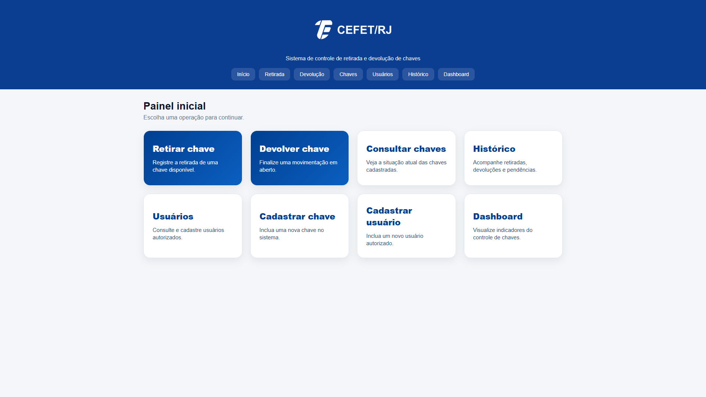
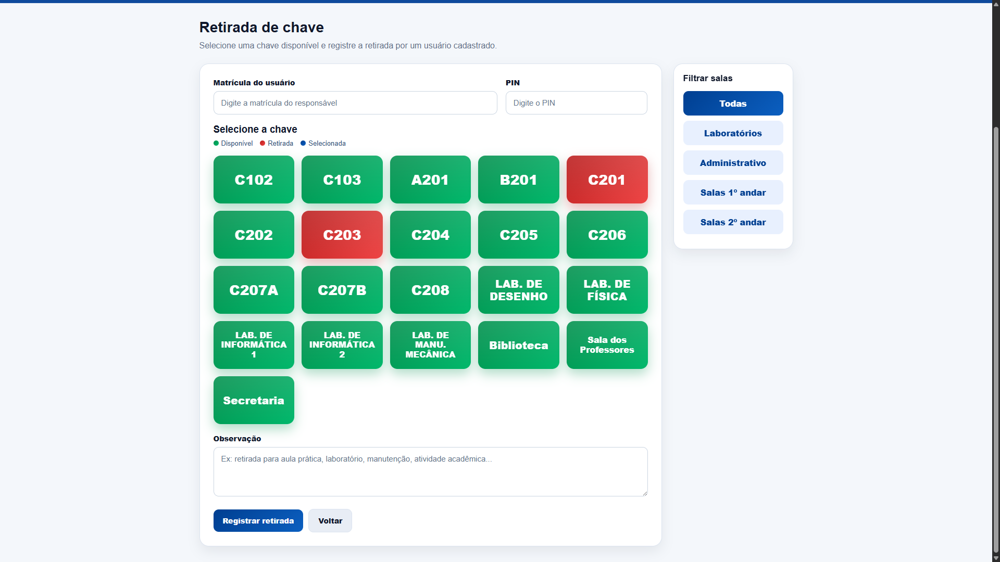
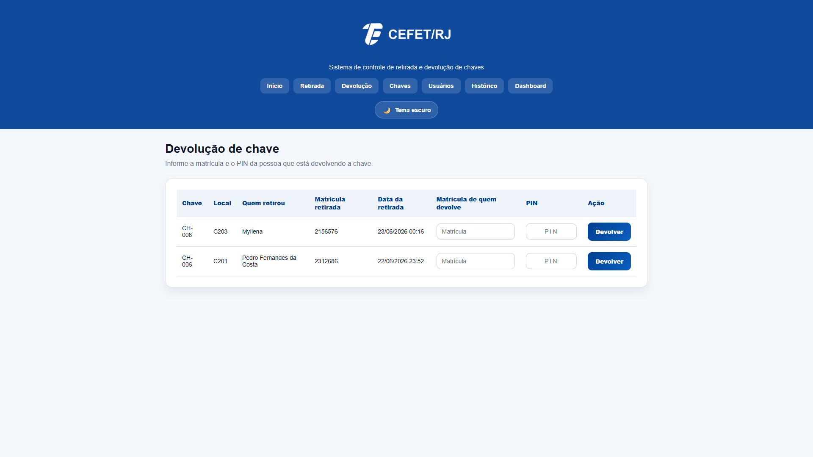
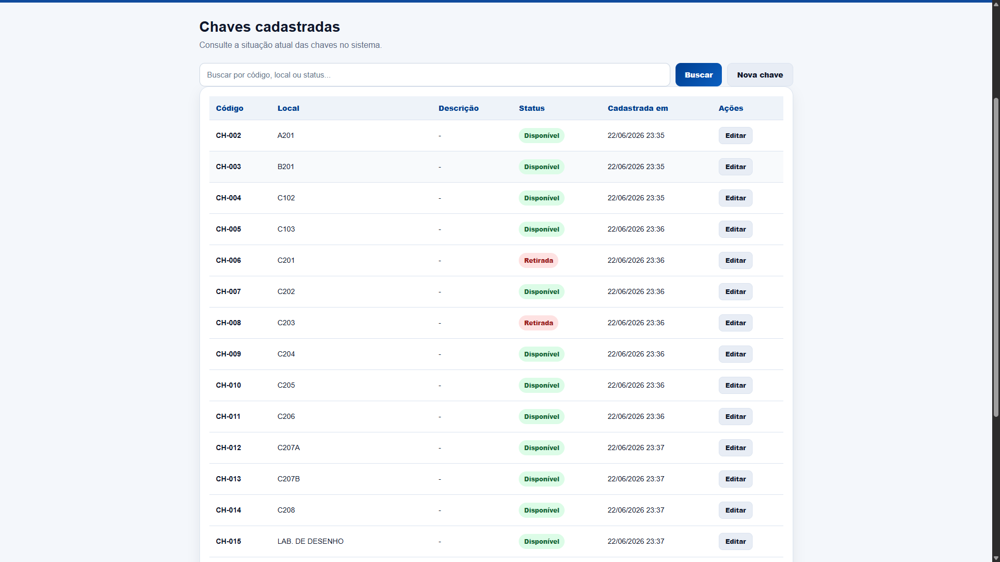
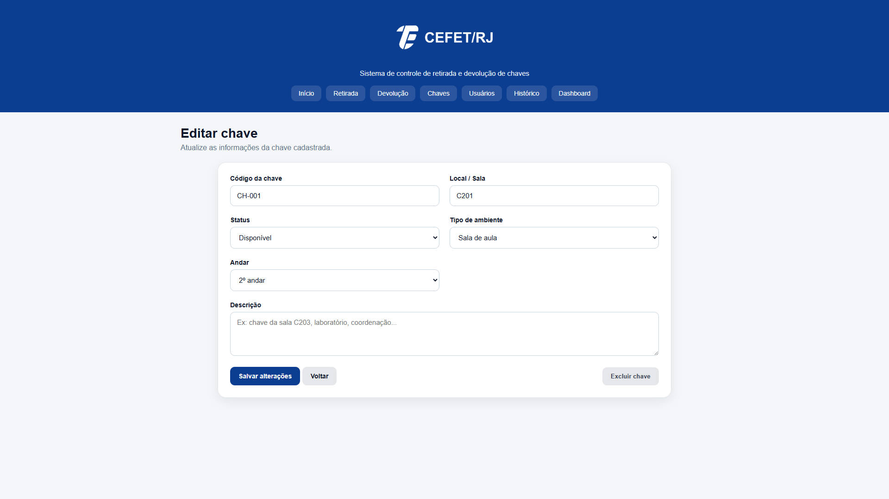
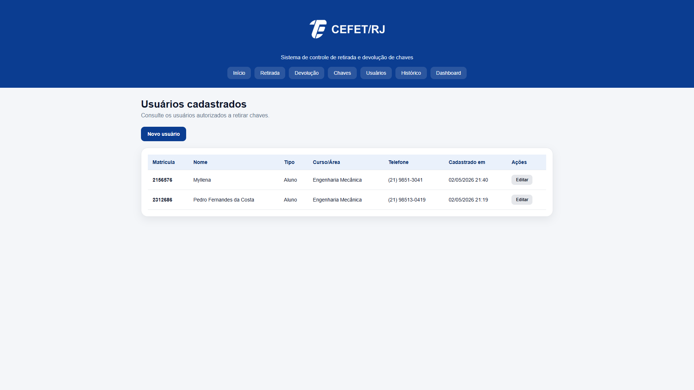
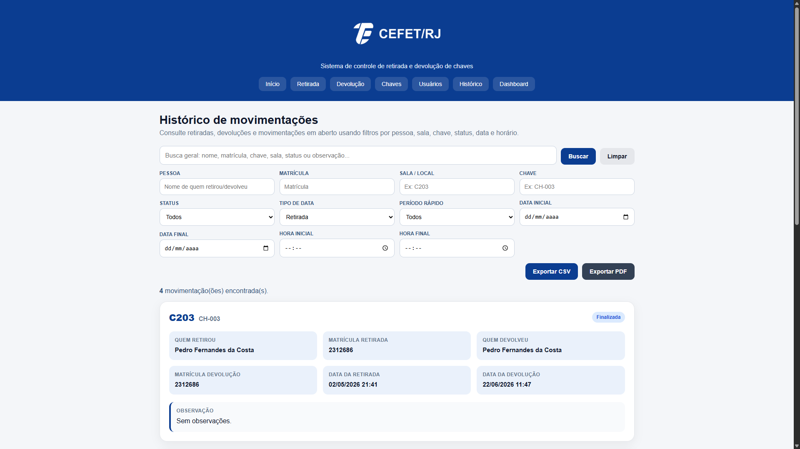
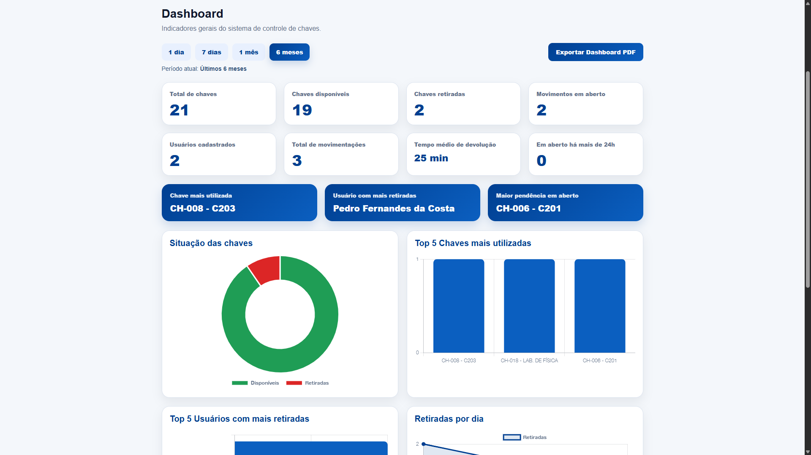

# Guardião de Chaves — Sistema de Controle de Chaves CEFET/RJ

Sistema web desenvolvido em **Python + Flask** para controle de retirada, devolução, consulta e gestão de chaves em ambiente institucional.

O projeto foi desenvolvido para a disciplina **Projeto e Produto** do **CEFET/RJ**, com o objetivo de substituir controles manuais por uma solução digital, rastreável, segura e fácil de usar em computadores, tablets e celulares.

---

## Visão geral

O **Guardião de Chaves** permite controlar quais chaves estão disponíveis, quais estão retiradas, quem retirou, quem devolveu, quando a movimentação aconteceu e quais pendências ainda estão em aberto.

Além do controle operacional, o sistema também possui **dashboard com indicadores**, **histórico filtrável**, **exportação em CSV/PDF**, **autenticação por PIN com hash** e telas de edição para usuários e chaves.

---

## Demonstração visual


### Tela inicial



---

### Retirada de chave



---


### Devolução com matrícula e PIN



---

### Chaves cadastradas



---

### Editar chave



---

### Usuários cadastrados



---

### Histórico de movimentações



---

### Dashboard de indicadores



---

## Funcionalidades principais

### Controle de chaves

- Cadastro de novas chaves;
- Consulta de chaves cadastradas;
- Edição de código, local, descrição, status, tipo de ambiente e andar;
- Exclusão segura com modal de confirmação;
- Bloqueio de exclusão quando a chave possui histórico de movimentações;
- Status automático: **Disponível** ou **Retirada**.

### Controle de usuários

- Cadastro de usuários autorizados;
- Classificação por tipo de usuário: aluno, professor, técnico ou funcionário;
- Cadastro de matrícula, nome, curso/área e telefone;
- Edição de informações do usuário;
- Redefinição de PIN;
- Padronização automática de telefone.

### Segurança por PIN

- Cada usuário possui um **PIN de 4 dígitos**;
- O PIN não é salvo diretamente no banco;
- O sistema armazena apenas o **hash do PIN**;
- Na devolução, o PIN precisa corresponder à matrícula informada;
- Caso o usuário esqueça o PIN, ele pode ser redefinido pela tela de edição.

### Retirada de chaves

- Interface visual por cards;
- Cores para indicar disponibilidade:
  - verde: disponível;
  - vermelho: retirada;
  - azul: selecionada;
- Filtros por tipo de ambiente:
  - todas;
  - laboratórios;
  - administrativo;
  - salas do 1º andar;
  - salas do 2º andar;
- Registro de observações na retirada;
- Bloqueio de retirada de chaves indisponíveis.

### Devolução de chaves

- Lista de movimentações em aberto;
- Campo para matrícula da pessoa que está devolvendo;
- Campo de PIN obrigatório;
- A pessoa que devolve pode ser diferente da pessoa que retirou;
- O PIN precisa pertencer à matrícula digitada;
- Registro da pessoa que devolveu;
- Atualização automática da chave para **Disponível**.

### Histórico

- Consulta de todas as movimentações;
- Identificação de quem retirou e quem devolveu;
- Datas de retirada e devolução;
- Status da movimentação;
- Observações;
- Filtros por:
  - busca geral;
  - pessoa;
  - matrícula;
  - sala/local;
  - chave;
  - status;
  - data de retirada ou devolução;
  - período rápido;
  - intervalo de datas;
  - intervalo de horário.

### Exportações

- Exportação do histórico em **CSV**;
- Exportação do histórico em **PDF**;
- Exportação do dashboard em **PDF**;
- Exportações geradas na pasta `exports/`.

### Dashboard

O dashboard apresenta indicadores e gráficos para acompanhamento do controle de chaves.

Indicadores disponíveis:

- Total de chaves;
- Chaves disponíveis;
- Chaves retiradas;
- Movimentos em aberto;
- Usuários cadastrados;
- Total de movimentações;
- Tempo médio de devolução;
- Pendências com mais de 24 horas;
- Chave mais utilizada;
- Usuário com mais retiradas;
- Maior pendência em aberto.

Gráficos disponíveis:

- Situação das chaves;
- Top 5 chaves mais utilizadas;
- Top 5 usuários com mais retiradas;
- Retiradas por dia.

Filtros disponíveis no dashboard:

- 1 dia;
- 7 dias;
- 1 mês;
- 6 meses.

---

## Tecnologias utilizadas

- **Python**
- **Flask**
- **SQLite**
- **HTML**
- **CSS**
- **JavaScript**
- **Chart.js**
- **ReportLab**
- **Werkzeug Security**
- **Git**
- **GitHub**

---

## Estrutura do projeto

```text
controle-chaves-cefet/
│
├── app.py
├── database.db
├── README.md
├── requirements.txt
├── schema.sql
│
├── templates/
│   ├── base.html
│   ├── index.html
│   ├── cadastrar_chave.html
│   ├── chaves.html
│   ├── editar_chave.html
│   ├── cadastrar_usuario.html
│   ├── usuarios.html
│   ├── editar_usuario.html
│   ├── retirada.html
│   ├── devolucao.html
│   ├── historico.html
│   ├── dashboard.html
│   └── confirmar_devolucao.html
│
├── static/
│   ├── style.css
│   └── logo-cefet.png
│
├── exports/
│   ├── historico_chaves.pdf
│   ├── movimentacoes_chaves.csv
│   └── dashboard_chaves_6m.pdf
│
└── docs/
    └── screenshots/
        ├── tela-inicial.png
        ├── retirada-chave.png
        ├── filtros-salas.png
        ├── devolucao-pin.png
        ├── chaves-cadastradas.png
        ├── editar-chave.png
        ├── modal-exclusao-chave.png
        ├── usuarios-cadastrados.png
        ├── cadastro-usuario.png
        ├── editar-usuario.png
        ├── historico.png
        ├── filtros-historico.png
        ├── exportar-historico-pdf.png
        ├── dashboard.png
        ├── dashboard-filtros.png
        └── dashboard-pdf.png
```

---

## Como rodar o projeto

### 1. Clone o repositório

```bash
git clone https://github.com/Pedro-fcosta/controle-chaves-cefet.git
```

### 2. Entre na pasta do projeto

```bash
cd controle-chaves-cefet
```

### 3. Crie o ambiente virtual

No Windows:

```bash
python -m venv venv
```

No Linux/Mac:

```bash
python3 -m venv venv
```

### 4. Ative o ambiente virtual

No Windows:

```bash
.\venv\Scripts\activate
```

No Linux/Mac:

```bash
source venv/bin/activate
```

### 5. Instale as dependências

```bash
pip install -r requirements.txt
```

Caso o arquivo `requirements.txt` ainda não esteja atualizado, instale manualmente:

```bash
pip install flask reportlab
```

### 6. Execute o sistema

```bash
python app.py
```

### 7. Acesse no navegador

```text
http://127.0.0.1:5000
```

---

## Banco de dados

O projeto utiliza banco local em **SQLite**.

Arquivo principal:

```text
database.db
```

Tabelas principais:

```text
usuarios
chaves
movimentacoes
```

### Tabela `usuarios`

Armazena os usuários autorizados a retirar e devolver chaves.

Campos principais:

```text
id
matricula
nome
tipo_usuario
curso_setor
telefone
pin_hash
criado_em
```

### Tabela `chaves`

Armazena as chaves cadastradas no sistema.

Campos principais:

```text
id
codigo
local
descricao
status
criado_em
tipo
andar
```

### Tabela `movimentacoes`

Armazena retiradas e devoluções.

Campos principais:

```text
id
usuario_id
chave_id
usuario_devolucao_id
data_retirada
data_devolucao
status
observacao
```

---

## Regras de negócio

- Uma chave só pode ser retirada se estiver com status **Disponível**;
- Ao retirar uma chave, o sistema altera o status para **Retirada**;
- Ao devolver uma chave, o sistema altera o status para **Disponível**;
- Uma movimentação em aberto só é finalizada quando ocorre devolução;
- A devolução exige matrícula e PIN da pessoa que está devolvendo;
- A pessoa que devolve pode ser diferente da pessoa que retirou;
- O PIN nunca é salvo em texto puro;
- Chaves com histórico não devem ser excluídas para preservar rastreabilidade;
- Exclusão de chave exige confirmação em pop-up;
- Dados exportados ficam na pasta `exports/`.

---

## Como resetar o banco de dados

Para apagar todos os dados e começar novamente:

1. Pare o Flask com `CTRL + C`;
2. Apague o arquivo:

```text
database.db
```

3. Rode novamente:

```bash
python app.py
```

O sistema recriará o banco automaticamente.

> Atenção: isso apaga usuários, chaves, movimentações e histórico.


## Fluxo recomendado com Git

Antes de alterar o projeto:

```bash
git checkout main
git pull
```

Crie uma branch para sua tarefa:

```bash
git checkout -b nome-da-tarefa
```

Depois de alterar e testar:

```bash
git status
git add .
git commit -m "Descreve a alteração feita"
git push origin nome-da-tarefa
```

No GitHub, abra um Pull Request para revisão.

---

## Sugestão de `.gitignore`

```gitignore
__pycache__/
*.pyc
venv/
.venv/
.env
.DS_Store
*_backup.db
database_backup.db
exports/*.pdf
exports/*.csv
```

> Caso o banco tenha apenas dados fictícios para demonstração, manter `database.db` no repositório pode facilitar a apresentação do projeto.

---

## Status do projeto

Projeto funcional e em fase de refinamento final.

Funcionalidades implementadas:

- [x] Cadastro de chaves
- [x] Edição de chaves
- [x] Exclusão segura de chaves
- [x] Cadastro de usuários
- [x] Edição de usuários
- [x] PIN com hash
- [x] Retirada visual por cards
- [x] Filtros por tipo de sala
- [x] Devolução com matrícula e PIN
- [x] Histórico filtrável
- [x] Exportação CSV
- [x] Exportação PDF do histórico
- [x] Dashboard com gráficos
- [x] Filtros de período no dashboard
- [x] Exportação PDF do dashboard
- [x] Interface responsiva

---

## Melhorias futuras

Possíveis evoluções do sistema:

- Login administrativo;
- Perfis de acesso;
- QR Code para chaves;
- Leitor de código de barras;
- Backup automático do banco;
- Notificação de chaves pendentes;
- Controle de prazo máximo de devolução;
- Integração com e-mail;
- Deploy online;
- Painel específico para tablet;
- Logs administrativos;
- Exportação com gráficos no PDF;
- Filtros avançados no dashboard;
- Integração com Power BI.

---

## Integrantes do grupo

```text
Pedro Fernandes da Costa
Myllena Borré de Oliveira
Bruno Leonardo Malafaia Vidal
```

---

## Professor

```text
Professor: HARON CALEGARI FANTICELLI
```

---

## Disciplina

```text
Projeto e Produto
```

---

## Instituição

```text
CEFET/RJ - UneD Itaguaí
```

---

## Observação

Este projeto utiliza dados fictícios para fins acadêmicos, demonstração e portfólio.

A proposta é demonstrar como ferramentas simples e acessíveis podem ser usadas para resolver um problema real de controle, rastreabilidade e gestão em ambiente institucional.

---

## Autor

Desenvolvido por **Pedro Fernandes da Costa**,**Myllena Borré de Oliveira** e **Bruno Leonardo Malafaia Vidal** .

Estudante de Engenharia Mecânica no CEFET/RJ, com interesse em desenvolvimento de soluções aplicadas à engenharia, automação de processos, análise de dados, sistemas industriais e melhoria contínua.
